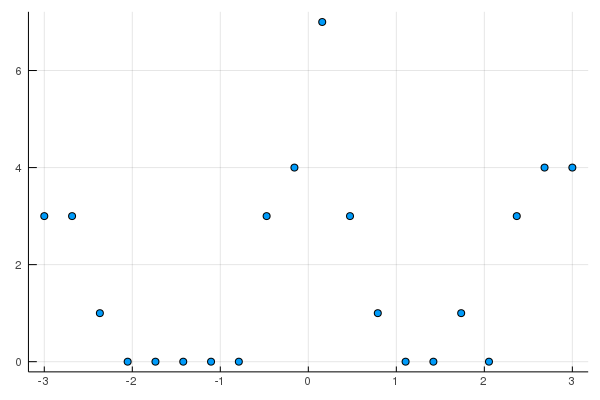
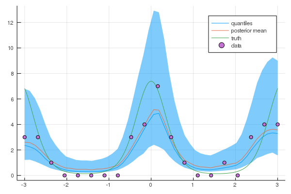
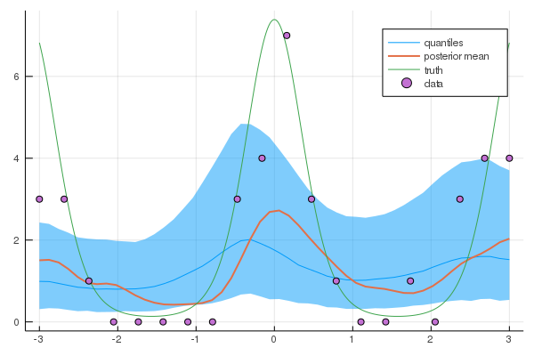

# Poisson Regression

Gaussian process models can be incredibly flexbile for modelling non-Gaussian data. One such example is in the case of count data $\mathbf{y}$, which can be modelled with a __Poisson model__ with a latent Gaussian process.
$$
\mathbf{y} \ | \ \mathbf{f} \sim \prod_{i=1}^{n} \frac{\lambda_i^{y_i}\exp\{-\lambda_i\}}{y_i!},
$$
where $\lambda_i=\exp(f_i)$ and $f_i$ is the latent Gaussian process.


```julia
#Load the package
using GaussianProcesses, Random, Distributions

#Simulate the data
Random.seed!(203617)
n = 20
X = collect(range(-3,stop=3,length=n));
f = 2*cos.(2*X);
Y = [rand(Poisson(exp.(f[i]))) for i in 1:n];

#Plot the data using the Plots.jl package with the GR backend
using Plots
gr()
scatter(X,Y,leg=false, fmt=:png)
```





```julia
#GP set-up
k = Matern(3/2,0.0,0.0)   # Matern 3/2 kernel
l = PoisLik()             # Poisson likelihood
gpmc = GP(X, vec(Y), MeanZero(), k, l)
gpvi = GP(X, vec(Y), MeanZero(), k, l)
```


    GP Approximate object:
      Dim = 1
      Number of observations = 20
      Mean function:
        Type: MeanZero, Params: Float64[]
      Kernel:
        Type: Mat32Iso{Float64}, Params: [0.0, 0.0]
      Likelihood:
        Type: PoisLik, Params: Any[]
      Input observations =
    [-3.0 -2.68421 … 2.68421 3.0]
      Output observations = [3, 3, 1, 0, 0, 0, 0, 0, 3, 4, 7, 3, 1, 0, 0, 1, 0, 3, 4, 4]
      Log-posterior = -65.397


```julia
set_priors!(gpmc.kernel,[Normal(-2.0,4.0),Normal(-2.0,4.0)])
@time samples = mcmc(gpmc; nIter=10000);
```

    Number of iterations = 10000, Thinning = 1, Burn-in = 1
    Step size = 0.100000, Average number of leapfrog steps = 10.029000
    Number of function calls: 100291
    Acceptance rate: 0.801400
      4.052686 seconds (24.20 M allocations: 2.026 GiB, 8.23% gc time)


```julia
#Sample predicted values
xtest = range(minimum(gpmc.x),stop=maximum(gpmc.x),length=50);
ymean = [];
fsamples = Array{Float64}(undef,size(samples,2), length(xtest));
for i in 1:size(samples,2)
    set_params!(gpmc,samples[:,i])
    update_target!(gpmc)
    push!(ymean, predict_y(gpmc,xtest)[1])
    fsamples[i,:] = rand(gpmc, xtest)
end

#Predictive plots

q10 = [quantile(fsamples[:,i], 0.1) for i in 1:length(xtest)]
q50 = [quantile(fsamples[:,i], 0.5) for i in 1:length(xtest)]
q90 = [quantile(fsamples[:,i], 0.9) for i in 1:length(xtest)]
plot(xtest,exp.(q50),ribbon=(exp.(q10), exp.(q90)),leg=true, fmt=:png, label="quantiles")
plot!(xtest,mean(ymean), label="posterior mean")
xx = range(-3,stop=3,length=1000);
f_xx = 2*cos.(2*xx);
plot!(xx, exp.(f_xx), label="truth")
scatter!(X,Y, label="data")
```





### Alternatives to MCMC

As an alternative to MCMC, the practioner is also able to compute the approximate posterior using variational inference. This is done through the approach described in [Khan et. al.](http://papers.nips.cc/paper/4535-fast-bayesian-inference-for-non-conjugate-gaussian-process-regression). An approximate density $$q(\mathbf{x})=(2 \pi)^{-N / 2}|\mathbf{\Sigma}|^{-\frac{1}{2}} e^{-\frac{1}{2}(\mathbf{x}-\boldsymbol{\mu})^{\top} \boldsymbol{\Sigma}^{-1}(\mathbf{x}-\boldsymbol{\mu})}$$ is used to replace the true posterior.

Syntactically, this can be found in a similar vein to mcmc by simply using the following statements.


```julia
@time Q = vi(gpvi);
```

    Number of iterations = 1, Thinning = 1, Burn-in = 1
    Step size = 0.100000, Average number of leapfrog steps = 7.000000
    Number of function calls: 8
    Acceptance rate: 0.000000
      1.517399 seconds (1.09 M allocations: 471.231 MiB, 6.14% gc time)


```julia
nsamps = 500
ymean = [];
visamples = Array{Float64}(undef, nsamps, size(xtest, 1))

for i in 1:nsamps
    visamples[i, :] = rand(gpvi, xtest, Q)
    push!(ymean, predict_y(gpvi, xtest)[1])
end

q10 = [quantile(visamples[:, i], 0.1) for i in 1:length(xtest)]
q50 = [quantile(visamples[:, i], 0.5) for i in 1:length(xtest)]
q90 = [quantile(visamples[:, i], 0.9) for i in 1:length(xtest)]
plot(xtest, exp.(q50), ribbon=(exp.(q10), exp.(q90)), leg=true, fmt=:png, label="quantiles")
plot!(xtest, mean(ymean), label="posterior mean", w=2)
xx = range(-3,stop=3,length=1000);
f_xx = 2*cos.(2*xx);
plot!(xx, exp.(f_xx), label="truth")
scatter!(X,Y, label="data")
```



